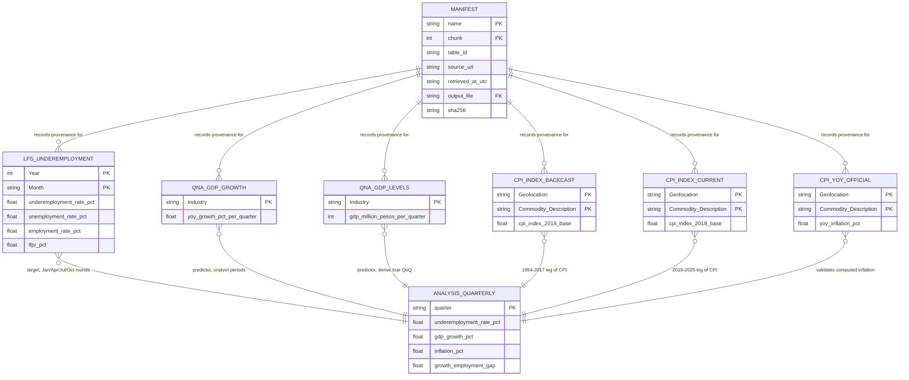

# Data Dictionary — National Underemployment Forecast

Documents every file landed in `data/raw/` by `scripts/ingest.py`, plus the entity model showing how
those extracts relate and how they will be combined in Phase 3.

- **Source:** PSA OpenSTAT, PX-Web REST API — `https://openstat.psa.gov.ph/PXWeb/api/v1/en/DB`
- **Ingestion path:** API (Path A)
- **Pull date documented here:** 2026-08-02
- **Regenerate with:** `python scripts/ingest.py`

Per-file provenance — source URL, exact query, UTC timestamp, SHA-256 — lives in
`data/raw/_manifest.json`, described at the bottom of this document.

## File naming convention

```text
<source>_<dataset>_<psa_table_id>_<pull_date>[_partN].csv
psa_openstat_lfs_underemployment_0021B3FKEI2_2026-08-02_part1.csv
```

| Segment | Meaning |
| --- | --- |
| `psa_openstat` | Source system, so a file is traceable if copied out of this repo |
| `lfs_underemployment` | Dataset slug — matches the `name` in `TABLES` in `scripts/ingest.py` |
| `0021B3FKEI2` | PSA's own PX-Web table id, for tracing back to the exact source table |
| `2026-08-02` | Pull date, ISO 8601 |
| `_partN` | Present only when a query exceeded the API's 1000-cell cap and was split |

Each extract is accompanied by `<stem>_meta.json` — the PX-Web variable metadata as it stood at
pull time, which is what makes the positional value codes interpretable later.

## Entity relationship diagram



`ANALYSIS_QUARTERLY` is the **planned** Phase 3 output — it does not exist yet. It is shown because
it is the only place the six extracts actually join: they share no key in their raw form, and each
must be reshaped onto a common quarter before they can be combined.

## Cross-cutting conventions

Read these before writing `transform.py` — each one silently corrupts results if missed.

| Convention | Detail |
| --- | --- |
| Missing values | `.` — meaning the survey did not run that period. **Not zero.** |
| Encoding | UTF-8 with BOM. Read with `utf-8-sig`. |
| Two layouts | LFS is **long** (periods as rows). GDP and CPI are **wide** (periods as columns, one data row). PX-Web chooses per table. |
| Aggregate rows | LFS carries `Annual` alongside the 12 months; CPI carries `Ave`. These are annual aggregates, **not periods** — including them double-counts. |
| Decimal separator | `.` — plain, no thousands separators. |

## Raw extracts

### 1. `psa_openstat_lfs_underemployment_0021B3FKEI2_<date>_part{1,2}.csv`

**Target variable.** PSA table `0021B3FKEI2.px`, "Rates Key Employment Indicators: April 2005 to
May 2026". Layout **long**; 6 columns; 247 + 39 = **286 rows** across two parts (split because the
full query was 1144 cells, over the API's 1000-cell cap).

| Column | Type | Unit | Domain / notes |
| --- | --- | --- | --- |
| `Year` | integer | year | 2005–2026 |
| `Month` | string | — | `January`…`December`, plus `Annual` (aggregate — exclude) |
| `Labor Force Participation Rate Both sexes` | float | percent | Share of population 15+ in the labor force |
| `Employment Rate Both sexes` | float | percent | Share of labor force employed |
| `Unemployment Rate Both sexes` | float | percent | Share of labor force unemployed |
| `Underemployment Rate Both sexes` | float | percent | **Modelling target.** Employed persons wanting more hours or better work |

**Observation frequency is mixed** — confirmed by counting non-missing cells, not assumed:

| Period | Rounds carried | Frequency |
| --- | --- | --- |
| 2005 | Apr, Jul, Oct | quarterly (LFS began April 2005) |
| 2006–2020 | Jan, Apr, Jul, Oct | quarterly |
| 2021–2025 | all 12 months | monthly |
| 2026 | Jan–May | monthly, partial year |

149 of 286 cells carry a value (52%). Taking Jan/Apr/Jul/Oct as Q1–Q4 yields roughly **85 quarterly
observations**.

### 2. `psa_openstat_qna_gdp_growth_0062B5BPRQ2_<date>.csv`

PSA table `0062B5BPRQ2.px`, "Gross National Income and Gross Domestic Product by Industry, Growth
Rates". Layout **wide**; 105 columns; 1 data row.

| Column | Type | Unit | Domain / notes |
| --- | --- | --- | --- |
| `Industry` | string | — | `..Gross Domestic Product` (leading dots are PX-Web hierarchy indent) |
| `At Constant 2018 Prices <YYYY>-<YYYY+1> Q<n>` | float | percent | 104 columns, `2000-2001 Q1` … `2025-2026 Q4` |

**These are year-on-year growth rates, not quarter-on-quarter.** The paired year label
(`2000-2001`) means the quarter is compared with the same quarter one year earlier. 101 of 104
present; missing `2025-2026 Q2`, `Q3`, `Q4` — not yet published.

Spot-checked: `2025-2026 Q1 = 2.8`, matching PSA's published 2.8% Q1 2026 figure.

### 3. `psa_openstat_qna_gdp_levels_0052B5BPRQ1_<date>.csv`

PSA table `0052B5BPRQ1.px`, "Gross National Income and Gross Domestic Product by Industry".
Pulled so true quarter-on-quarter growth can be derived. Layout **wide**; 109 columns; 1 data row.

| Column | Type | Unit | Domain / notes |
| --- | --- | --- | --- |
| `Industry` | string | — | `..Gross Domestic Product` |
| `At Constant 2018 Prices <YYYY> Q<n>` | integer | million pesos | 108 columns, `2000 Q1` … `2026 Q4` |

105 of 108 present; missing `2026 Q2`–`Q4`. Range `2000 Q1 = 1653296` to `2026 Q1 = 5626961`.

**Unit caveat:** the API metadata declares no unit. "Million pesos at constant 2018 prices" is
corroborated against PSA's published National Accounts and by magnitude (₱5.63T for 2026 Q1), but
confirm against the PSA table footnote before publishing any figure in pesos.

### 4. `psa_openstat_cpi_index_2018_2025_0012M4ACP09_<date>.csv`

PSA table `0012M4ACP09.px`. Layout **wide**; 106 columns; 1 data row. **104 of 104 present.**

| Column | Type | Unit | Domain / notes |
| --- | --- | --- | --- |
| `Geolocation` | string | — | `PHILIPPINES` (national only; 119 areas available in source) |
| `Commodity Description` | string | — | `0 - ALL ITEMS` (headline; 354 groups available) |
| `<YYYY> <Mon>` | float | index, 2018=100 | 104 columns, `2018 Jan` … `2025 Dec`, plus `<YYYY> Ave` per year |

### 5. `psa_openstat_cpi_index_backcast_1994_2017_0012M4ACP15_<date>.csv`

PSA table `0012M4ACP15.px`, backcasted values. Layout **wide**; 314 columns; 1 data row.
**312 of 312 present.**

| Column | Type | Unit | Domain / notes |
| --- | --- | --- | --- |
| `Geolocation` | string | — | `PHILIPPINES` |
| `Commodity Description` | string | — | `0 - ALL ITEMS` |
| `<YYYY> <Mon>` | float | index, 2018=100 | 312 columns, `1994 Jan` … `2017 Dec`, plus `<YYYY> Ave` |

**Why both CPI index tables:** PSA's ready-made inflation table starts January 2019 — only ~28
quarters, too short to forecast on with two predictors. These two index tables share the 2018=100
base and join continuously (`2017 Ave = 95.01` → `2018 Jan = 97.20`), giving a 1994–2025 monthly
series from which inflation is computed in Phase 3.

### 6. `psa_openstat_cpi_yoy_official_validation_0012M4ACP10_<date>.csv`

PSA table `0012M4ACP10.px`. **Not a model input.** Layout **wide**; 93 columns; 1 data row.
**91 of 91 present.**

| Column | Type | Unit | Domain / notes |
| --- | --- | --- | --- |
| `Geolocation` | string | — | `PHILIPPINES` |
| `Commodity Description` | string | — | `0 - ALL ITEMS` |
| `<YYYY> <Mon>` | float | percent | 91 columns, `2019 Jan` … `2025 Dec`, plus `<YYYY> Ave` |

Held only to check the inflation computed from tables 4 and 5 against PSA's official figures on the
2019–2025 overlap.

## `_manifest.json` — provenance record

A JSON array with one object per pull (7 records: 6 tables, LFS split into 2 parts).

| Field | Type | Description |
| --- | --- | --- |
| `name` | string | Dataset slug; with `chunk`, identifies the pull |
| `chunk` | integer | Part number, 1-based |
| `chunks_total` | integer | Parts this table was split into |
| `table_id` | string | PSA PX-Web table id, e.g. `0021B3FKEI2.px` |
| `title` | string | Table title as returned by the API at pull time |
| `source_url` | string | Full API URL the data came from |
| `query_body` | object | The exact POST body sent — makes the pull reproducible |
| `retrieved_at_utc` | string | ISO 8601 UTC timestamp of the pull |
| `http_status` | integer | Response status (200 for all current records) |
| `cells_requested` | integer | Cells this query asked for; the API caps at 1000 |
| `output_file` | string | Filename of the raw extract |
| `metadata_file` | string | Filename of the accompanying PX-Web metadata |
| `bytes` | integer | Size of the raw response |
| `sha256` | string | Checksum of the raw response, for change detection |
| `note` | string | Human note on the table's role and caveats |

## Known coverage limits

| Limit | Consequence |
| --- | --- |
| CPI ends December 2025 | The usable modelling window ends **2025Q4**, bounded by CPI — not by LFS, which runs to May 2026 |
| GDP unpublished beyond 2026 Q1 | Three trailing quarters are missing in both GDP extracts |
| LFS quarterly before 2021 | Sample is ~85 quarterly observations, not ~250 monthly ones |
| National scope only | Regional underemployment has no bulk PSA table; out of scope for v1 |
