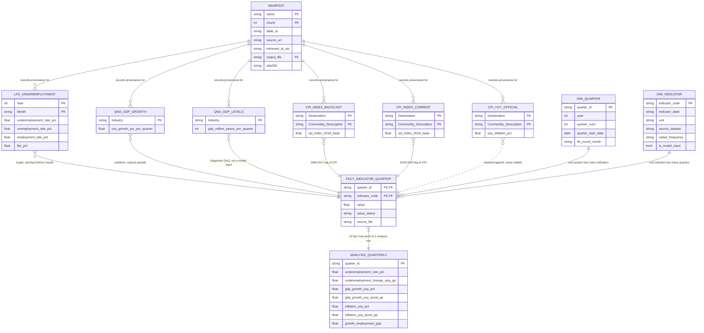

# Data Dictionary — National Underemployment Forecast

Documents every file landed in `data/raw/` by `scripts/ingest.py`, plus the entity model showing how
those extracts relate and how they will be combined in Phase 3.

- **Source:** PSA OpenSTAT, PX-Web REST API — `https://openstat.psa.gov.ph/PXWeb/api/v1/en/DB`
- **Ingestion path:** API (Path A)
- **Pull date documented here:** 2026-08-02
- **Regenerate with:** `python scripts/ingest.py`

Per-file provenance — source URL, exact query, UTC timestamp, SHA-256 — lives in
`data/raw/_manifest.json`, described at the bottom of this document.

## File naming convention

```text
<source>_<dataset>_<psa_table_id>_<pull_date>[_partN].csv
psa_openstat_lfs_underemployment_0021B3FKEI2_2026-08-02_part1.csv
```

| Segment | Meaning |
| --- | --- |
| `psa_openstat` | Source system, so a file is traceable if copied out of this repo |
| `lfs_underemployment` | Dataset slug — matches the `name` in `TABLES` in `scripts/ingest.py` |
| `0021B3FKEI2` | PSA's own PX-Web table id, for tracing back to the exact source table |
| `2026-08-02` | Pull date, ISO 8601 |
| `_partN` | Present only when a query exceeded the API's 1000-cell cap and was split |

Each extract is accompanied by `<stem>_meta.json` — the PX-Web variable metadata as it stood at
pull time, which is what makes the positional value codes interpretable later.

## Entity relationship diagram



The four tables on the right are the **planned** Phase 3 output — none of them exist yet. They are
shown because the processed layer is the only place the six extracts actually join: they share no key
in their raw form, and each must be reshaped onto a common quarter before they can be combined.
`FACT_INDICATOR_QUARTER` is where that join happens; `ANALYSIS_QUARTERLY` is a pivot of it, not a
second source of truth.

## Cross-cutting conventions

Read these before writing `transform.py` — each one silently corrupts results if missed.

| Convention | Detail |
| --- | --- |
| Missing values | `.` — meaning the survey did not run that period. **Not zero.** |
| Encoding | UTF-8 with BOM. Read with `utf-8-sig`. |
| Two layouts | LFS is **long** (periods as rows). GDP and CPI are **wide** (periods as columns, one data row). PX-Web chooses per table. |
| Aggregate rows | LFS carries `Annual` alongside the 12 months; CPI carries `Ave`. These are annual aggregates, **not periods** — including them double-counts. |
| Decimal separator | `.` — plain, no thousands separators. |

## Raw extracts

### 1. `psa_openstat_lfs_underemployment_0021B3FKEI2_<date>_part{1,2}.csv`

**Target variable.** PSA table `0021B3FKEI2.px`, "Rates Key Employment Indicators: April 2005 to
May 2026". Layout **long**; 6 columns; 247 + 39 = **286 rows** across two parts (split because the
full query was 1144 cells, over the API's 1000-cell cap).

| Column | Type | Unit | Domain / notes |
| --- | --- | --- | --- |
| `Year` | integer | year | 2005–2026 |
| `Month` | string | — | `January`…`December`, plus `Annual` (aggregate — exclude) |
| `Labor Force Participation Rate Both sexes` | float | percent | Share of population 15+ in the labor force |
| `Employment Rate Both sexes` | float | percent | Share of labor force employed |
| `Unemployment Rate Both sexes` | float | percent | Share of labor force unemployed |
| `Underemployment Rate Both sexes` | float | percent | **Modelling target.** Employed persons wanting more hours or better work |

**Observation frequency is mixed** — confirmed by counting non-missing cells, not assumed:

| Period | Rounds carried | Frequency |
| --- | --- | --- |
| 2005 | Apr, Jul, Oct | quarterly (LFS began April 2005) |
| 2006–2020 | Jan, Apr, Jul, Oct | quarterly |
| 2021–2025 | all 12 months | monthly |
| 2026 | Jan–May | monthly, partial year |

149 of 286 cells carry a value (52%). Taking Jan/Apr/Jul/Oct as Q1–Q4 yields roughly **85 quarterly
observations**.

### 2. `psa_openstat_qna_gdp_growth_0062B5BPRQ2_<date>.csv`

PSA table `0062B5BPRQ2.px`, "Gross National Income and Gross Domestic Product by Industry, Growth
Rates". Layout **wide**; 105 columns; 1 data row.

| Column | Type | Unit | Domain / notes |
| --- | --- | --- | --- |
| `Industry` | string | — | `..Gross Domestic Product` (leading dots are PX-Web hierarchy indent) |
| `At Constant 2018 Prices <YYYY>-<YYYY+1> Q<n>` | float | percent | 104 columns, `2000-2001 Q1` … `2025-2026 Q4` |

**These are year-on-year growth rates, not quarter-on-quarter.** The paired year label
(`2000-2001`) means the quarter is compared with the same quarter one year earlier. 101 of 104
present; missing `2025-2026 Q2`, `Q3`, `Q4` — not yet published.

Spot-checked: `2025-2026 Q1 = 2.8`, matching PSA's published 2.8% Q1 2026 figure.

### 3. `psa_openstat_qna_gdp_levels_0052B5BPRQ1_<date>.csv`

PSA table `0052B5BPRQ1.px`, "Gross National Income and Gross Domestic Product by Industry".
Pulled so true quarter-on-quarter growth can be derived. Layout **wide**; 109 columns; 1 data row.

| Column | Type | Unit | Domain / notes |
| --- | --- | --- | --- |
| `Industry` | string | — | `..Gross Domestic Product` |
| `At Constant 2018 Prices <YYYY> Q<n>` | integer | million pesos | 108 columns, `2000 Q1` … `2026 Q4` |

105 of 108 present; missing `2026 Q2`–`Q4`. Range `2000 Q1 = 1653296` to `2026 Q1 = 5626961`.

**Unit caveat:** the API metadata declares no unit. "Million pesos at constant 2018 prices" is
corroborated against PSA's published National Accounts and by magnitude (₱5.63T for 2026 Q1), but
confirm against the PSA table footnote before publishing any figure in pesos.

### 4. `psa_openstat_cpi_index_2018_2025_0012M4ACP09_<date>.csv`

PSA table `0012M4ACP09.px`. Layout **wide**; 106 columns; 1 data row. **104 of 104 present.**

| Column | Type | Unit | Domain / notes |
| --- | --- | --- | --- |
| `Geolocation` | string | — | `PHILIPPINES` (national only; 119 areas available in source) |
| `Commodity Description` | string | — | `0 - ALL ITEMS` (headline; 354 groups available) |
| `<YYYY> <Mon>` | float | index, 2018=100 | 104 columns, `2018 Jan` … `2025 Dec`, plus `<YYYY> Ave` per year |

### 5. `psa_openstat_cpi_index_backcast_1994_2017_0012M4ACP15_<date>.csv`

PSA table `0012M4ACP15.px`, backcasted values. Layout **wide**; 314 columns; 1 data row.
**312 of 312 present.**

| Column | Type | Unit | Domain / notes |
| --- | --- | --- | --- |
| `Geolocation` | string | — | `PHILIPPINES` |
| `Commodity Description` | string | — | `0 - ALL ITEMS` |
| `<YYYY> <Mon>` | float | index, 2018=100 | 312 columns, `1994 Jan` … `2017 Dec`, plus `<YYYY> Ave` |

**Why both CPI index tables:** PSA's ready-made inflation table starts January 2019 — only ~28
quarters, too short to forecast on with two predictors. These two index tables share the 2018=100
base and join continuously (`2017 Ave = 95.01` → `2018 Jan = 97.20`), giving a 1994–2025 monthly
series from which inflation is computed in Phase 3.

### 6. `psa_openstat_cpi_yoy_official_validation_0012M4ACP10_<date>.csv`

PSA table `0012M4ACP10.px`. **Not a model input.** Layout **wide**; 93 columns; 1 data row.
**91 of 91 present.**

| Column | Type | Unit | Domain / notes |
| --- | --- | --- | --- |
| `Geolocation` | string | — | `PHILIPPINES` |
| `Commodity Description` | string | — | `0 - ALL ITEMS` |
| `<YYYY> <Mon>` | float | percent | 91 columns, `2019 Jan` … `2025 Dec`, plus `<YYYY> Ave` |

Held only to check the inflation computed from tables 4 and 5 against PSA's official figures on the
2019–2025 overlap.

## `_manifest.json` — provenance record

A JSON array with one object per pull (7 records: 6 tables, LFS split into 2 parts).

| Field | Type | Description |
| --- | --- | --- |
| `name` | string | Dataset slug; with `chunk`, identifies the pull |
| `chunk` | integer | Part number, 1-based |
| `chunks_total` | integer | Parts this table was split into |
| `table_id` | string | PSA PX-Web table id, e.g. `0021B3FKEI2.px` |
| `title` | string | Table title as returned by the API at pull time |
| `source_url` | string | Full API URL the data came from |
| `query_body` | object | The exact POST body sent — makes the pull reproducible |
| `retrieved_at_utc` | string | ISO 8601 UTC timestamp of the pull |
| `http_status` | integer | Response status (200 for all current records) |
| `cells_requested` | integer | Cells this query asked for; the API caps at 1000 |
| `output_file` | string | Filename of the raw extract |
| `metadata_file` | string | Filename of the accompanying PX-Web metadata |
| `bytes` | integer | Size of the raw response |
| `sha256` | string | Checksum of the raw response, for change detection |
| `note` | string | Human note on the table's role and caveats |

## Processed layer schema (Phase 3 plan)

Everything above describes what `ingest.py` lands. This section is the **design for
`data/processed/`** — written before any transformation code, so Weeks 9–10 have a target to build
against rather than a shape that emerges by accident. Nothing here exists yet.

### Design decisions this schema encodes

**1. Two grains, two tables — never mixed.** The six raw extracts carry no shared key, and they are
not even the same shape (LFS long, GDP and CPI wide). They meet only once both are reshaped onto a
common quarter. `fact_indicator_quarter` is that meeting point, at one row per indicator per quarter.
`analysis_quarterly` is a pivot of it at one row per quarter. Putting both grains in one table is the
mistake this split exists to avoid.

**2. The modelling window is 2005Q2 – 2025Q4: exactly 83 quarters, no gaps.** 2005Q1 predates the
survey (LFS began April 2005); 2025Q4 is the end of CPI coverage, not of LFS. Confirmed by counting
non-missing cells in the raw extracts, not assumed.

**3. A quarter's LFS value is its round-month value** — January, April, July, October map to Q1–Q4.
The survey was quarterly through 2020 and monthly from 2021, so averaging the three months where
they exist would change the estimator midway through the series and manufacture a 2021 level shift
that is an artefact of cleaning rather than of the labour market. One estimator, all 83 quarters.
Week 11 checks the round-month value against the 3-month mean on the 2021–2025 overlap and logs the
divergence.

**4. The target is a quarter-to-quarter change; the predictors are year-on-year.** This looks
inconsistent and is deliberate. Measured on the raw extracts, 2005–2025:

| Series | sd of its QoQ change | share of that variance that is pure calendar |
| --- | --- | --- |
| Underemployment rate | 2.00 pp | **23 %** |
| GDP, from unadjusted levels | 10.02 % | **94 %** |

A quarter-to-quarter change in underemployment is a usable signal — mildly seasonal, absorbed by
three quarter dummies. A quarter-to-quarter change in GDP computed from the unadjusted levels table
is 94 % calendar: its seasonal means run from −9.93 % (Q4→Q1) to +13.86 % (Q3→Q4). Using it raw
would mean modelling the calendar. So the predictors are PSA's published **year-on-year** growth and
inflation, which carry no seasonal by construction, plus their **one-quarter accelerations**
(`yoy(t) − yoy(t−1)`) — genuine quarter-to-quarter changes in a seasonally clean series, which is
what matches a QoQ target's footing without inventing a seasonal adjustment of our own.

`gdp_growth_qoq` is still computed and stored, flagged `is_model_input = false`, so the dashboard can
show it and nobody can quietly turn it into a feature later.

**5. Lags are not stored in the fact.** A lag is the same indicator at a different quarter — in long
form that is a self-join, not a new fact. `analysis_quarterly` materialises the `_lag1` columns
because it is the denormalised modelling view; the fact stays normalised.

### `dim_quarter`

- **File:** `data/processed/dim_quarter.csv`
- **Grain:** one row = **one calendar quarter** in the modelling window
- **Primary key:** `quarter_id`
- **Rows:** 83

| Column | Meaning | Expected type |
| --- | --- | --- |
| `quarter_id` | `YYYYQn`, e.g. `2005Q2` | string |
| `year` | 2005–2025 | integer |
| `quarter_num` | 1–4; the seasonal dummy source | integer |
| `quarter_start_date` | first day of the quarter | date |
| `quarter_end_date` | last day of the quarter | date |
| `lfs_round_month` | `January`/`April`/`July`/`October` — which LFS round supplied this quarter | string |

### `dim_indicator`

- **File:** `data/processed/dim_indicator.csv`
- **Grain:** one row = **one measured or derived indicator**
- **Primary key:** `indicator_code`
- **Rows:** 14

| Column | Meaning | Expected type |
| --- | --- | --- |
| `indicator_code` | stable slug, e.g. `underemployment_rate` | string |
| `indicator_label` | human label for charts and SQL output | string |
| `unit` | `percent`, `pp`, `index_2018=100`, `million_php_const2018` | string |
| `source_dataset` | matches the `name` in `TABLES` in `scripts/ingest.py` | string |
| `source_table_id` | PSA PX-Web table id, traceable to the raw extract | string |
| `native_frequency` | `quarterly` / `monthly` / `derived` | string |
| `aggregation_method` | how it reached quarterly: `round_month`, `quarter_mean`, `computed` | string |
| `is_model_input` | guards `gdp_growth_qoq` and the context series from becoming features | boolean |

Indicator rows, and which are model inputs:

| `indicator_code` | Role | `is_model_input` |
| --- | --- | --- |
| `underemployment_change_qoq` | **model target** | — (target) |
| `gdp_growth_yoy` | predictor | true |
| `gdp_growth_yoy_accel` | predictor | true |
| `inflation_yoy` | predictor | true |
| `inflation_yoy_accel` | predictor | true |
| `underemployment_rate` | the level the target differences | false |
| `unemployment_rate`, `employment_rate`, `lfpr` | LFS context | false |
| `cpi_index`, `gdp_level` | source levels | false |
| `underemployment_change_yoy` | KPI input | false |
| `growth_employment_gap` | headline dashboard KPI | false |
| `gdp_growth_qoq` | **diagnostic only — 94 % calendar, do not model on this** | false |

### `fact_indicator_quarter`

- **File:** `data/processed/fact_indicator_quarter.csv`
- **Grain:** one row = **one indicator's value for one quarter**
- **Primary key:** composite, `(quarter_id, indicator_code)`
- **Foreign keys:** `quarter_id` → `dim_quarter`, `indicator_code` → `dim_indicator`
- **Rows:** up to 83 × 14 = 1 162, fewer where a derived series has no value at the window start

| Column | Meaning | Expected type |
| --- | --- | --- |
| `quarter_id` | FK to `dim_quarter` | string |
| `indicator_code` | FK to `dim_indicator` | string |
| `value` | the observation; **null where genuinely absent** | float, nullable |
| `value_status` | `observed` (as published) / `derived` (computed here) / `missing` | string |
| `source_file` | the `data/raw/` filename this traces back to | string |

Nulls stay null. A quarter with no survey round is not a zero, and the target must never be imputed
into.

### `analysis_quarterly`

- **File:** `data/processed/analysis_quarterly.csv` — **the main processed deliverable**
- **Grain:** one row = **one quarter**, every indicator as a column
- **Primary key:** `quarter_id`
- **Rows:** 83

| Column | Meaning | Expected type |
| --- | --- | --- |
| `quarter_id`, `year`, `quarter_num`, `quarter_start_date` | calendar keys from `dim_quarter` | string / int / int / date |
| `underemployment_rate_pct` | the level | float |
| **`underemployment_change_qoq_pp`** | `rate(t) − rate(t−1)` — **the model target** | float |
| `unemployment_rate_pct`, `employment_rate_pct`, `lfpr_pct` | LFS context | float |
| `gdp_growth_yoy_pct` | PSA published YoY growth, constant 2018 prices | float |
| `gdp_growth_yoy_accel_pp` | `yoy(t) − yoy(t−1)` | float |
| `inflation_yoy_pct` | computed from the stitched CPI index | float |
| `inflation_yoy_accel_pp` | `yoy(t) − yoy(t−1)` | float |
| `gdp_growth_yoy_pct_lag1`, `gdp_growth_yoy_accel_pp_lag1`, `inflation_yoy_pct_lag1`, `inflation_yoy_accel_pp_lag1` | one-quarter-ahead features | float |
| `naive_forecast_change_pp` | ≡ 0, the no-change baseline the model must beat | float |
| `cpi_index_2018base`, `gdp_level_mn_php_const2018` | source levels | float |
| `gdp_growth_qoq_pct` | **diagnostic only, not seasonally adjusted** | float |
| `underemployment_change_yoy_pp` | `rate(t) − rate(t−4)` | float |
| `growth_employment_gap` | `gdp_growth_yoy_pct − underemployment_change_yoy_pp` | float |

**Two different quantities, deliberately both present.** The *model target* is the QoQ change. The
*headline dashboard KPI* `growth_employment_gap` is computed year-on-year on both sides, so the
subtraction shares a window — the README defines the gap as "GDP growth minus the change in the
underemployment rate" without fixing a basis, and this is that basis. They answer different
questions and must not be swapped for one another.

### Expected null pattern

Not data quality problems — arithmetic consequences of differencing at the window start, and the
Week 11 validation asserts they appear exactly here and nowhere else:

| Column | Null at | Why |
| --- | --- | --- |
| `underemployment_change_qoq_pp` | 2005Q2 | no 2005Q1 to difference from |
| `underemployment_change_yoy_pp`, `growth_employment_gap` | 2005Q2 – 2006Q1 | needs `t−4` |
| all `*_lag1` columns | 2005Q2 | needs `t−1` |

### Storage

CSV is the committed format — diffable in git, readable without tooling, and the Milestone 3
deliverable. `scripts/load_db.py` loads the four CSVs into `data/processed/underemployment.db`
(SQLite, stdlib `sqlite3`) with explicit DDL — declared types, `PRIMARY KEY`, `FOREIGN KEY`,
`PRAGMA foreign_keys = ON` — so the keys above are enforced by the database rather than merely
described here. The `.db` is a rebuildable build artefact and is gitignored; the CSVs are the
source of truth.

## Known coverage limits

| Limit | Consequence |
| --- | --- |
| CPI ends December 2025 | The usable modelling window ends **2025Q4**, bounded by CPI — not by LFS, which runs to May 2026 |
| GDP unpublished beyond 2026 Q1 | Three trailing quarters are missing in both GDP extracts |
| LFS quarterly before 2021 | Sample is ~85 quarterly observations, not ~250 monthly ones |
| National scope only | Regional underemployment has no bulk PSA table; out of scope for v1 |
